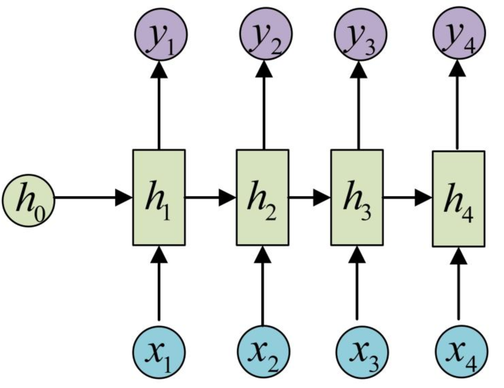

# Ai4Science知识点补充


## 第一节 如何将化学知识转化为计算机可识别的形式
当我们谈论到化学这门学科的时候，大家应该都会情不自禁地想起元素周期表，分子式，化学反应方程，以及熵、焓、自由能等等复杂且繁多地化学知识。同物理、生物等传统学科一样，当前化学这门学科的知识和内容主要都是用文本和化学领域专有符号记录的，这些符号之中的意义计算机无法直观地理解。但是，其实随着计算机技术的发展，将化学知识用计算机存储的方法也一直在发展和进步，只是这些内容并未像GPT等在文本领域创造了惊天动地的成就，所以往往不为人们所知。

### AI4Science的早期历史（概要）
AI4Science的发展历史大致也经历这三个阶段：
1. 将化学知识以计算机形式存储，并构建数据库；
2. 机器学习；
3. 深度学习。

在第一个阶段中，人们主要做的事情就是尝试使用不同的方法，尽可能地将化学知识和信息以计算机的形式进行存储，并以此为基础开始构建数据库。例如，用一些字符表示分子或者其他化学符号，如何保存一个具有空间结构的分子的原子、键的位置信息等等。
在第二阶段，大家开始使用一些手动的特征工程对已有数据进行编码、特征提取等操作。例如，在baseline中我们使用了分子指纹（molecule fingerprint）作为我们的编码方式。再辅以传统的机器学习的方法，做一些预测。
在第三阶段，各种各样的深度神经网络也开始被广泛使用。这些网络不仅仅开始学习各种特征，也像word2vec那样，非常多的网络也被拿来对分子进行向量化。这也导致后来又非常多的新型的分子指纹出现。基于seq2seq模型学习表示为序列类型的化学数据、基于diffusion重建分子三维空间结构等等，都是当今的潮流方向。

### SMILES —— 最流行的将分子表示为序列类型数据的方法
SMILES，提出者Weininger et al[1]，全称是Simplified Molecular Input Line Entry System，是一种将化学分子用ASCII字符表示的方法，在化学信息学领域有着举足轻重的作用。当前对于分子和化学式的储存形式，几乎都是由SMILES（或者它的一些手足兄弟）完成的。使用非常广泛的分子/反应数据库，例如ZINC[2]，ChemBL[3]，USPTO[4]等，都是采用这种形式存储。SMILES将化学分子中涉及的原子、键、电荷等信息，用对应的ASCII字符表示；环、侧链等化学结构信息，用特定的书写规范表达。以此，几乎所有的分子都可以用特定的SMILES表示，且SMILES的表示还算比较直观。

表1：一些常见的化学结构用SMILES表示。  


表2：化学反应也可以用SMILES表示，用“>>”连接产物即可。  


表3：一些常见分子的SMILES例子


在SMILES中，原子由他们的化学符号表示，=表示双键、#表示三键、[]表示侧基或者特殊原子（例如带电）。通过SMLIES，就可以把分子表示为序列类型的数据了。

（注：SMILES有自己的局限性：例如选择不同的起始原子，写出来的SMILES不同；它无法表示空间信息。）

拓展：事实上，使用图数据（grpah）表示分子是非常合适的。图网络相比于基于SMILES的序列网络，在某些仿麦呢会更胜一筹。感兴趣的同学可以自行探索。

### 分子指纹 —— 分子向量化
分子的指纹就像人的指纹一样，用于表示特定的分子。分子指纹是一个具有固定长度的位向量（即由0，1组成），其中，每个为1的值表示这个分子具有某些特定的化学结构。例如，对于一个只有长度为2的分子指纹，我们可以设定第一个值表示分子是否有甲基，第二个位置的值表示分子是都有苯环，那么[0,1]的分子指纹表示的就是一个有苯环而没有甲基的分子。通常，分子指纹的维度都是上千的，也即记录了上千个子结构是否出现在分子中。
（这非常像NLP中的Bag of Word）。
有一定化学知识的小伙伴可能会发现：例如像氯甲基苯的邻位和对位，采用分子指纹的形式就无法区分出来。

图1 氯甲基苯的邻位（左）和对位（右）
](../img/task2/邻氯甲苯-对氯甲苯.png)

也正是随着解决这类问题的需求的增加，后续发展出了非常多的新式的分子指纹。例如，就有前面提到的通过模型学习出来的分子指纹。（类似NLP中word2vec方法）。

### rdkit —— 强大、丰富且高效的化学信息工具
化学信息学中主要的工具，开源。网址：http://www.rdkit.org，支持WIN\MAC\Linux，可以被python、Java、C调用。几乎所有的与化学信息学相关的内容都可以在上面找到。常用的功能包括：
1. 读和写分子；
2. 循环获取分子中原子、键、环的信息；
3. 修饰分子；
4. 获取分子指纹；
5. 计算分子相似性；
6. 将分子绘制为图片；
7. 子结构匹配和搜索；
8. 生成和优化3D结构。

RDkit会将分子读取为RDkit中专属的rdkit.Chem.rdchem.Mol对象，并以Mol对象为基础，可以对分子进行转化为各种表达形式，例如SMILES、SMARTS；
```python
from rdkit import Chem
m = Chem.MolFromSmiles('Cc1ccccc1')
res = Chem.MolToSmarts()
# res : [#6]-[#6]1:[#6]:[#6]:[#6]:[#6]:[#6]:1
```
绘制图片：
```python
from rdkit.Chem import Draw
img = Draw.MolToImage(m)
```

子结构搜索：
```python
m = Chem.MolFromSmiles('c1ccccc1O')
patt = Chem.MolFromSmarts('ccO')
m.HasSubstructMatch(patt)
# True
```
获得分子指纹（fingerprint）并通过指纹计算分子之间的相似性：
```python
from rdkit import Chem
from rdkit import DataStructs
from rdkit.Chem import AllChem
ms = [Chem.MolFromSmiles('CCOC'), Chem.MolFromSmiles('CCO'),
Chem.MolFromSmiles('COC')]
fpgen = AllChem.GetRDKitFPGenerator()
fps = [fpgen.GetFingerprint(x) for x in ms]
DataStructs.TanimotoSimilarity(fps[0],fps[1]) # TanimotoSimilarity是计算分子相似性的其中一个指标，更多指标详见RDkit官网
# 0.6
DataStructs.TanimotoSimilarity(fps[0],fps[2])
# 0.4
DataStructs.TanimotoSimilarity(fps[1],fps[2])
# 0.25
```
Tanimoto Similarity计算方法：

其中：$b_x, b_y$就是是分子指纹。

## 机器学习
机器学习按照目标可以分为分类任务（classification）和回归（regression）任务两大类。所谓分类任务，就是模型预测的结果是离散的值，例如类别；那么，回归任务中，模型预测的结果就是连续的值，例如房价等等。在本次竞赛中，我们需要预测的目标是反应的产率，是0-1之间的一个连续的数值，所以是一个回归任务。（注：离散值通过一些处理可以认为是连续值，所以不要被连续值和离散值限制了自己的思维）。

传统的机器学习需要需要经历特征工程这一步骤，即将原始数据转化为向量形式。然后通过SVM、Random Forest等算法学习数据的规律或者将数据划开。这些方法在处理简单的任务时是比较有效的。

图2 决策树 （左）分类型决策树，（右）回归型决策树

划分每个节点的目标是让该节点中的值尽可能相同。在分类任务中，常见的就是信息熵衡量；在回归任务中，可以使用均方误差、绝对误差等进行衡量。

图2 随机森林

将多个决策树结合在一起，训练每个决策树的数据集都是随机有放回地从原数据中选出。预测的时候，输入会通过每个决策树进行预测，然后考虑每个树地输出结果，得到最终的预测值。

## 深度学习
深度学习可以归为机器学习的一个子集，主要通过神经网络学习数据的特征和分布。深度学习的一个重要进化是不再需要繁琐的特征工程，让神经网络自己从里面学习特征。

SMILES是一种以ASCII组成的序列，可以被理解为一种“化学语言”。既然是一种语言，那么很自然地想到了可以使用NLP中的方法对SMILES进行建模。

使用RNN对SMILES建模是早期的一个主要方法。RNN（Recurrent Neural Network）是处理序列数据的一把好手。RNN的网络每层除了会有自己的输出以外，还会输出一个隐向量到下一层。

图2 RNN的架构示意图

其中，每一层相当于做了一次线性变换：
$$h_n = \sigma(W_{hh}h_{n-1} + W_{hx}x_n + b_n)$$
每层的输出：$$ y_n = Softmax(Vh_n + c) $$
通过隐向量的不断传递，序列后面的部分就通过“阅读”隐向量，获取前面序列的信息，从而提升学习能力。

但是RNN也有缺点：如果序列太长，那么两个相距比较远的字符之间的联系需要通过多个隐藏向量。这就像人和人之间传话一样，传递的人多了，很容易导致信息的损失或者扭曲。因此，它对长序列的记忆能力较弱。
同时，RNN需要一层一层地传递，所以并行能力差，比较容易出现梯度消失或梯度爆炸问题。

在后面学习中，我们会继续学习使用Transformer这种架构，这种架构就完美解决了长序列学习能力差、难以并行、出现梯度消失或者爆炸等问题。

# 参考文献
[1] D. Weininger. Smiles, a chemical language and information system. 1. introduction to methodology and encoding rules. Journal of chemical information and computer sciences, 28(1):31–36, 1988.
[2] J. J. Irwin, T. Sterling, M. M. Mysinger, E. S. Bolstad, and R. G. Coleman. ZINC: a free tool to discover chemistry for biology. Journal of chemical information and modeling, 52(7):1757–1768, 2012.
[3] A. Gaulton, L. J. Bellis, A. P. Bento, J. Chambers, M. Davies, A. Hersey, Y. Light, S. McGlinchey, D. Michalovich, B. Al-Lazikani, et al. ChEMBL: a large-scale bioactivity database for drug discovery. Nucleic acids research, 40(D1):D1100–D1107, 2012.
[4] D. Lowe. Chemical reactions from US patents (1976-sep2016). doi, 10:m9, 2018.