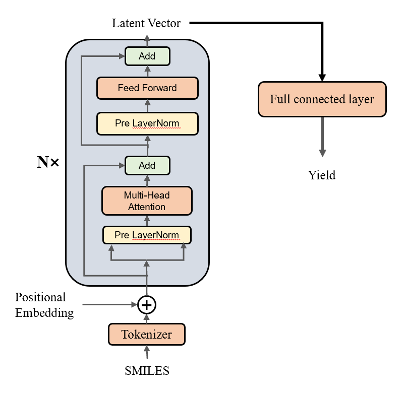

# Transformer

## transformer诞生的由来
循环神经网络的序列到序列建模方法，在建模文本长程依赖方面都存在一定的局限性。
循环神经网络：由于所有的前文信息都蕴含在一个隐向量里面，这会导致随着序列长度的增加，编码在隐藏状态中的序列早期的上下文信息被逐渐遗忘。
卷积神经网络：受限的上下文窗口在建模长文本方面天然地存在不足。如果需要关注长文本，就需要多层的卷积操作。

图1 循环神经网络中，每个词都会依赖上一个词

## 优势
完全通过注意力机制完成对序列的全局依赖的建模。并且，这是一种可以高并行的结构，大大增加了计算效率。

## 基本架构示意图

1. 嵌入层 (embedding layer)
将token转化为向量表示。模型认识的只是向量，所以需要将每个切分好的token转化为向量。
这个过程中，与RNN不同的是，我们在Transformer的嵌入层，会在词嵌入中加入位置编码（Positional Encoding）。

（为什么需要位置编码？ —— 在本节后面的讲解中，我们会学习到：transformer使用的多头注意力计算方式，无法获取到序列中各个字符的位置信息，因此需要认为地添加位置信息。）

位置编码通常使用不同频率的正余弦函数：

其中，$pos$ 表示单词所在的位置，$2i$ 和 $2i+1$ 表示位置编码向量中的对应维度，$d$则对应位置编码的总维度。

图2 位置编码的示意图。每个token都会变成token本身+位置信息

>上述方式编码的好处：
>- 首先，正余弦函数的范围是在 $[-1,+1]$，导出的位置编码与原词嵌入相加不会使得结果偏离过远而破坏原有单词的语义信息。
>- 其次，依据三角函数的基本性质，可以得知第$pos+k$ 个位置的编码是第 $pos$ 个位置的编码的线性组合，这就意味着位置编码中蕴含着单词之间的距离信息。

2. 自注意力层 （self-attention layer）
引入在注意力机制中：查询 $q_{i}（Query）$ ，键 $k_{i}（Key）$ ，值 $v_{i}（Value）$ 。在编码输入序列中每一个单词的表示的过程中，这三个元素用于计算上下文单词所对应的权重得分。
所谓自注意力就是Q\K\V的值都是输入序列本身。为了防止过大的匹配分数在后续 Softmax 计算过程中导致的梯度爆炸以及收敛效率差的问题，这些得分会除放缩因子 $\sqrt{d} $ 以稳定优化。放缩后的得分经过 Softmax 归一化为概率之后，与其他位置的值向量相乘来聚合希望关注的上下文信息，并最小化不相关信息的干扰。具体公式如下：

其中 $Q \in R^{L\times d_{q}}$, $K \in R^{L\times d_{k}}$, $V \in R^{L\times d_{v}}$分别表示输入序列中的不同单词的  $q,k,v$向量拼接组成的矩阵，L 表示序列长度， $Z \in R^{L\times d_{v}}$表示自注意力操作的输出。

3. 前馈层 (Feed Forward layer)
本质上，就是一个线性层。

实验结果表明，增大前馈子层隐状态的维度有利于提升最终翻译结果的质量，因此，前馈子层隐状态的维度一般比自注意力子层要大。

4. 残差连接
从基本架构图中我们可以看到，每个（LayerNorm layer）都有一个（Add），这就是一个残差连接。它的作用是用一条直连通道直接将对应子层的输入连接到输出上去，从而避免由于网络过深在优化过程中潜在的梯度消失问题。

5. 层归一化 （Layernorm）
我们直到，在神经网络中，我们经常对每一层的输出数据进行归一化，以使得模型更快达到收敛。只不过，前面的归一化方式几乎都是batch normalization，即对不同的batch进行归一化。Transformer在最开始被提出来的时候，采用的也是batch normalization。但是在人们后续的实践中发现，对于transformer而言，每一层间的归一化效果都要更好。
归一化操作的计算表达式：

其中 $\mu$  和 $\sigma$ 分别表示均值和方差，用于将数据平移缩放到均值为 0，方差为 1 的标准分布，$a$  和  $b$ 是可学习的参数。层归一化技术可以有效地缓解优化过程中潜在的不稳定、收敛速度慢等问题。
目的：为了进一步使得每一层的输入输出范围稳定在一个合理的范围内。

## 利用Transformer的Encoder作为编码器编码
Transformer也是一个经典的编码器-解码器模型（encoder-decoder model）。从基本架构图中也可以看到，编码器部分将输入转化为一个向量之后，再传递到了解码器部分。既然这样，我们完全可以把Transformer的Encoder和Decoder部分拆开，分别拿来使用。其实，在大语言模型中非常具有代表性的BERT和GPT就是这样干的，它俩分别使用了Transformer的Encoder部分和Decoder部分。

既然Encoder部分输出的本身就是一个向量（我们这里称之为向量$z$），那么只要模型学习得够好，那么这个向量就一定包含了重要得输入序列得信息。这就是为什么我们可以把Encoder单独拿出来并看作是一个编码器得原因。因此，我们可以将这个代表输入序列的向量$z$，再作为其他模型的输入（例如全连接网络等），从而进行我们想要的分类或者回归任务。这样的思路被广泛应用在AI领域的研究和工程中。

在这里，我们使用Transformer的Encoder部分，编码我们的SMILES表达式。然后，再将等到的向量$z$通过一个线性层，输出一个值。我们期望通过模型的学习，这个输出的值就是该化学反应的产率。

