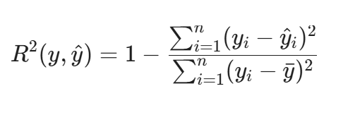

# 天池 物质科学与智能赛道 化学反应产率预测

## 任务
构建一个能够准确预测碳氮成键反应产率的预测模型。  
通过对反应中所包含的==反应底物、添加剂、溶剂以及产物==进行合理的特征化，运用机器学习模型或者深度学习模型拟合预测反应的产率。
或者利用训练集数据对开源大语言模型进行微调以预测反应的产率。

总结：
    输入：底物和条件
    输出：产率

## 数据
可以使用开源反应数据，若使用了开源反应数据，需要在代码审核阶段提供数据来源以及相关说明。

### 初赛
初赛数据集仅包含碳氮成键类型反应数据，其中训练集中包含23538条反应数据，测试集中包含2616条反应数据。训练集与测试集的比例接近9：1。每条训练数据包含 rxnid, Reactant1, Reactant2 , Product , Additive , Solvent , Yield 字段。其中 Reactant1 , Reactant2 , Product , Additive , Solvent 字段中为对应物质的==SMILES==字符串，Yield字段为目标字段，是经过归一化的浮点数。

## 评价指标
实验真实结果与预测结果$R^2$决定系数来进行评测:

## 提交的结果文件
rxnid,Yield
test1,0.5555
test2,0.6666
..., ...